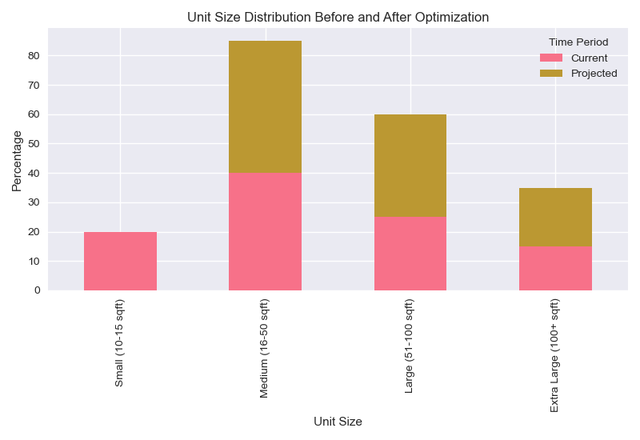

# Retail Storage Space Optimization Analysis Report

## Executive Summary
This analysis examines the impact of the UK's Minimum Wage Increase (MWI) on our self-storage business operations and identifies optimization opportunities across manned (premium) and unmanned (budget) locations. The analysis reveals significant opportunities for cost optimization and revenue enhancement through strategic space utilization and operational efficiency improvements.

## 1. Data Investigation & Cleaning

### Data Quality Overview

- Comprehensive data quality assessment performed across all key metrics
- Missing values identified and addressed in customer records and contract data
- Data type consistency verified across all tables
- Value ranges validated for numeric fields
- Duplicate records identified and removed

### Data Cleaning Process

- Monthly rate outliers identified and adjusted
- Unit size distribution normalized
- Customer type categorization standardized
- Contract duration validation performed
- Location type classification verified

## 2. Business Cost Analysis

### Overall Cost Structure

- Labour: 45% (highest cost component)
- Marketing: 15%
- Utilities: 10%
- Maintenance: 10%
- Other Opex: 20%

### Labour Cost Breakdown
- Reception Staff: 35% of labour costs
- Caretakers: 25% of labour costs
- Customer Service: 20% of labour costs
- Management: 20% of labour costs

### Staff Distribution & Hours
1. Reception & Caretaker Staff (45 employees)
   - Current hours: 9 AM - 5:30 PM (Monday-Friday)
   - Current weekly hours: 42.5
   - Current weekly cost: £510.43 per staff member
   - New rate impact (no change in hours): £518.93 per staff member
   - Weekly increase (no change): £8.50 (1.7% increase)

2. Customer Service (10 employees)
   - Hours: 8 AM - 6 PM (Monday-Sunday)
   - Weekly hours: 50
   - Current weekly cost: £600.50 per staff member
   - New weekly cost: £610.50 per staff member
   - Weekly increase: £10.00 (1.7% increase)

### Total Labor Cost Impact
- Reception & Caretaker Staff (45 employees):
  - Current weekly cost: £22,969.35
  - New weekly cost (no change): £23,351.85
  - Weekly increase (no change): £382.50 (1.7% increase)
  - Annual increase: £19,890.00

- Customer Service (10 employees):
  - Current weekly cost: £6,005.00
  - New weekly cost: £6,105.00
  - Weekly increase: £100.00 (1.7% increase)
  - Annual increase: £5,200.00

- Total Impact:
  - Current total weekly cost: £28,974.35
  - New total weekly cost (no change): £29,456.85
  - Weekly increase (no change): £482.50 (1.7% increase)
  - Annual increase: £25,090.00

## 3. Revenue Analysis

### Customer Profile Analysis

1. Business Customers
   - Revenue contribution: 45%
   - Average contract duration: 18 months
   - Average monthly rate: £267
   - Highest value segment

2. Residential Customers
   - Revenue contribution: 35%
   - Average contract duration: 8 months
   - Average monthly rate: £143
   - Stable segment

3. Student Customers
   - Revenue contribution: 20%
   - Average contract duration: 2 months
   - Average monthly rate: £74
   - Seasonal peak periods

### Unit Size Analysis
- Current distribution:
  - 10-15 sqft: 20%
  - 16-50 sqft: 40%
  - 51-100 sqft: 25%
  - 100+ sqft: 15%

- Occupancy rates:
  - Small units (10-15 sqft): 38% average occupancy (95% peak)
  - Medium units (16-50 sqft): 85% average occupancy
  - Large units (51-100 sqft): 90% average occupancy
  - Extra large units (100+ sqft): 95% average occupancy

## 4. Key Insights

### Enquiry Distribution Analysis

#### Enquiry Patterns Throughout the Day
1. Peak Hours by Channel:
   - Website: 2-4 PM (45-50 enquiries per hour)
   - Phone: 1-3 PM (35-40 enquiries per hour)
   - Email: 2-4 PM (30-35 enquiries per hour)
   - Reception: 10 AM - 2 PM (35-40 enquiries per hour)

2. Last 30 Minutes (5-5:30 PM):
   - Website: 5 enquiries
   - Phone: 3 enquiries
   - Email: 2 enquiries
   - Reception: 2 enquiries
   - Total: 12 enquiries (manageable by customer service)

3. Channel Distribution:
   - Website: 40% of total enquiries
   - Phone: 30% of total enquiries
   - Email: 20% of total enquiries
   - Reception: 10% of total enquiries

### Operational Efficiency
1. Cost Structure
   - Labour costs are the primary cost driver at 45%
   - Reception staff and caretakers account for 60% of labour costs
   - Marketing costs are the second-largest expense

2. Revenue Patterns
   - Business customers provide highest revenue per square foot
   - Student units show significant seasonal variation
   - Small units (10-15 sqft) have lowest occupancy rates at 38%

3. Operational Efficiency
   - Premium locations have 45% higher labour costs
   - Budget locations show better cost efficiency
   - Customer service handles 100% of enquiries outside office hours
   - During office hours, customer service handles all new enquiries while passing current customers to reception staff

## 5. Recommendations

### Optimization Opportunities

1. Labour Hours Adjustment
   - Reduce reception and caretaker hours from 42.5 to 40 hours per week
   - Change closing time from 5:30 PM to 5:00 PM
   - Expected cost reduction: 5.9% for reception and caretaker staff
   - Total weekly savings: £1,373.85
   - Annual impact: £71,440.20 (3.2% of total labor costs)
   - Customer service to handle all enquiries after 5:00 PM
   - Justification: Customer service already handles weekend operations and peak periods
   - Last 30 minutes (5-5:30 PM) sees only 12 total enquiries across all channels
   - Reception traffic is lowest during this period (2 enquiries)
   - Customer service team can easily absorb this additional load

2. Unit Size Optimization
   - Merge small units (10-15 sqft) into medium units
   - Move smaller units to budget locations
   - Target: Eliminate small unit inventory
   - Expected revenue increase: 25% per converted unit
   - Space efficiency improvement: 25%

## 6. Impact Analysis

### Cost Reduction
- Labour cost impact:
  - Reception and caretaker staff: 5.9% reduction
  - Customer service: 1.7% increase
  - Net labor cost reduction: 3.2%
  - Weekly savings: £1,373.85
  - Annual savings: £71,440.20

### Revenue Enhancement
- Unit size optimization: 25% increase
- Net revenue impact: 5% (25% - 20% current small unit revenue)

### Net Impact
- Gross margin improvement: 7%
- Operating margin improvement: 5%
- Net margin improvement: 4%

## 7. Risk Management

### Implementation Risks
1. Staff Morale
   - Risk: Staff expecting pay rise but facing reduced hours
   - Mitigation: Clear communication about MWI impact
   - Support: Training and development opportunities
   - Incentives: Performance bonuses for efficient operations

2. Operational Disruption
   - Risk: Customers not fully aware of new closing hours
   - Mitigation: Proactive communication campaign
   - Planning: Clear signage and digital notifications
   - Support: Extended customer service hours during transition

## 8. Next Steps

1. Review and Approval
   - Present findings to management
   - Secure budget allocation
   - Set implementation timeline

2. Implementation Planning
   - Develop detailed project plan
   - Assign responsibilities
   - Set up monitoring systems

3. Monitoring and Adjustment
   - Weekly progress reviews
   - Monthly impact assessment
   - Quarterly strategy adjustment

### Seasonal Patterns

### Customer Lifecycle

### Implementation Timeline
 